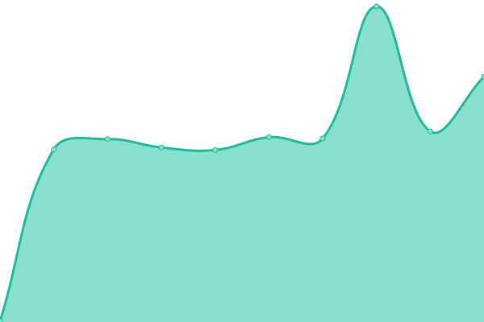

# [📈 Live Status](https://demo.upptime.js.org): <!--live status--> **🟧 Partial outage**

This repository contains the open-source uptime monitor and status page for [Upptime](https://upptime.js.org), powered by [Upptime](https://github.com/upptime/upptime).

With [Upptime](https://upptime.js.org), you can get your own unlimited and free uptime monitor and status page, powered entirely by a GitHub repository. We use [Issues](https://github.com/upptime/upptime/issues) as incident reports, [Actions](https://github.com/Kadantte/candy-up/actions) as uptime monitors, and [Pages](https://demo.upptime.js.org) for the status page.

<!--start: status pages-->
<!-- This summary is generated by Upptime (https://github.com/upptime/upptime) -->
<!-- Do not edit this manually, your changes will be overwritten -->
<!-- prettier-ignore -->
| URL | Status | History | Response Time | Uptime |
| --- | ------ | ------- | ------------- | ------ |
|  [Kadantte](https://kadantte.moe) | 🟩 Up | [kadantte.yml](https://github.com/Kadantte/candy-up/commits/HEAD/history/kadantte.yml) | 

 167ms
     
 | 

<a href="https://status.kadantte.moe/history/kadantte">100.00%</a>
    

|  [Why-inside.me](https://cdn.why-inside.me/c850ba698a4f459f17eacfcf5303e6f7.gif) | 🟩 Up | [why-inside-me.yml](https://github.com/Kadantte/candy-up/commits/HEAD/history/why-inside-me.yml) | 

 614ms
     
 | 

<a href="https://status.kadantte.moe/history/why-inside-me">100.00%</a>
    

|  [LiDa <3](https://LiDa.kadantte.repl.co) | 🟥 Down | [li-da-3.yml](https://github.com/Kadantte/candy-up/commits/HEAD/history/li-da-3.yml) | 

 199ms
     
 | 

<a href="https://status.kadantte.moe/history/li-da-3">97.68%</a>
    

|  [Lavalink](https://lidalavalink.kadantte.repl.co/metrics) | 🟥 Down | [lavalink.yml](https://github.com/Kadantte/candy-up/commits/HEAD/history/lavalink.yml) | 

 378ms
     
 | 

<a href="https://status.kadantte.moe/history/lavalink">98.37%</a>
    

|  [Anime List](https://list.kadantte.moe) | 🟩 Up | [anime-list.yml](https://github.com/Kadantte/candy-up/commits/HEAD/history/anime-list.yml) | 

 1381ms
     
 | 

<a href="https://status.kadantte.moe/history/anime-list">100.00%</a>
    

|  [Manga List](https://list.kadantte.moe/?type=manga) | 🟩 Up | [manga-list.yml](https://github.com/Kadantte/candy-up/commits/HEAD/history/manga-list.yml) | 

 845ms
     
 | 

<a href="https://status.kadantte.moe/history/manga-list">100.00%</a>
    

|  [AnimeChan](https://anichan.kadantte.moe) | 🟥 Down | [anime-chan.yml](https://github.com/Kadantte/candy-up/commits/HEAD/history/anime-chan.yml) | 

 422ms
     
 | 

<a href="https://status.kadantte.moe/history/anime-chan">92.37%</a>
    

|  [Li Da Server](https://me.kadantte.moe) | 🟩 Up | [li-da-server.yml](https://github.com/Kadantte/candy-up/commits/HEAD/history/li-da-server.yml) | 

 158ms
     
 | 

<a href="https://status.kadantte.moe/history/li-da-server">100.00%</a>
    

|  [Ev-Supervision](https://evsupervision.com/evsupervision/manager/signin) | 🟩 Up | [ev-supervision.yml](https://github.com/Kadantte/candy-up/commits/HEAD/history/ev-supervision.yml) | 

 365ms
     
 | 

<a href="https://status.kadantte.moe/history/ev-supervision">100.00%</a>
    

<!--end: status pages-->

[**Visit our status website →**](https://demo.upptime.js.org)

## 📄 License

- Powered by: [Upptime](https://github.com/upptime/upptime)
- Code: [MIT](./LICENSE) © [Upptime](https://upptime.js.org)
- Data in the `./history` directory: [Open Database License](https://opendatacommons.org/licenses/odbl/1-0/)
