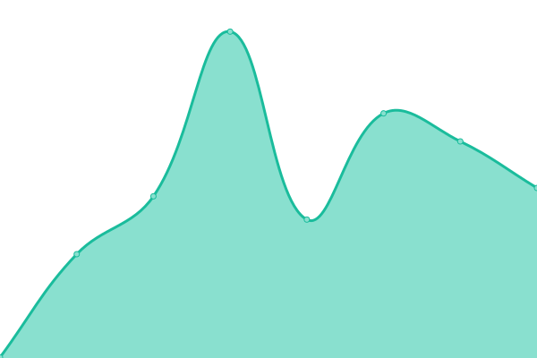
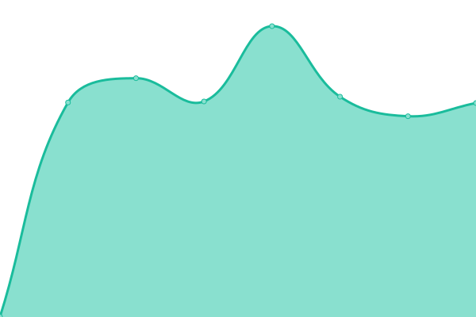
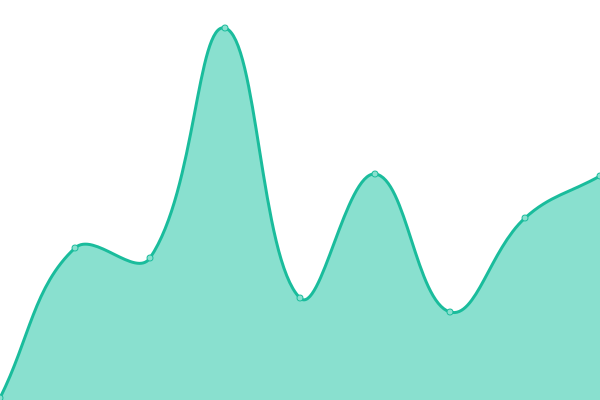
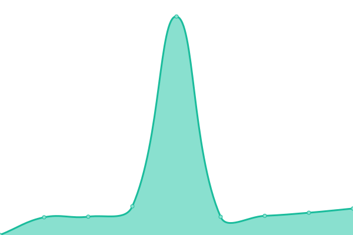
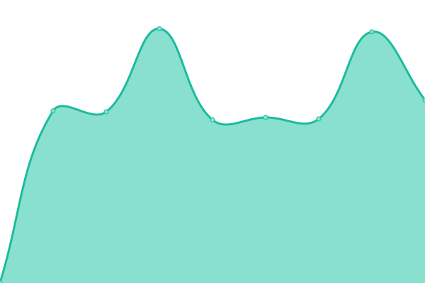

# [📈 Live Status](https://demo.upptime.js.org): <!--live status--> **🟧 Partial outage**

This repository contains the open-source uptime monitor and status page for [Upptime](https://upptime.js.org), powered by [Upptime](https://github.com/upptime/upptime).

With [Upptime](https://upptime.js.org), you can get your own unlimited and free uptime monitor and status page, powered entirely by a GitHub repository. We use [Issues](https://github.com/upptime/upptime/issues) as incident reports, [Actions](https://github.com/Kadantte/candy-up/actions) as uptime monitors, and [Pages](https://demo.upptime.js.org) for the status page.

<!--start: status pages-->
<!-- This summary is generated by Upptime (https://github.com/upptime/upptime) -->
<!-- Do not edit this manually, your changes will be overwritten -->
<!-- prettier-ignore -->
| URL | Status | History | Response Time | Uptime |
| --- | ------ | ------- | ------------- | ------ |
|  [Kadantte](https://kadantte.moe) | 🟩 Up | [kadantte.yml](https://github.com/Kadantte/candy-up/commits/HEAD/history/kadantte.yml) | 

 210ms
     
 | 

<a href="https://status.kadantte.moe/history/kadantte">100.00%</a>
    

|  [Why-inside.me](https://cdn.why-inside.me) | 🟥 Down | [why-inside-me.yml](https://github.com/Kadantte/candy-up/commits/HEAD/history/why-inside-me.yml) | 

 859ms
     
 | 

<a href="https://status.kadantte.moe/history/why-inside-me">98.89%</a>
    

|  [My Resume](https://kadantte.moe/cv/) | 🟩 Up | [my-resume.yml](https://github.com/Kadantte/candy-up/commits/HEAD/history/my-resume.yml) | 

 110ms
     
 | 

<a href="https://status.kadantte.moe/history/my-resume">100.00%</a>
    

|  [CANNAFLEX](https://cannaflex.ma) | 🟥 Down | [cannaflex.yml](https://github.com/Kadantte/candy-up/commits/HEAD/history/cannaflex.yml) | 

 463ms
     
 | 

<a href="https://status.kadantte.moe/history/cannaflex">98.18%</a>
    

|  [Why-Inside Me CDN](https://cdn.why-inside.me) | 🟥 Down | [why-inside-me-cdn.yml](https://github.com/Kadantte/candy-up/commits/HEAD/history/why-inside-me-cdn.yml) | 

 844ms
     
 | 

<a href="https://status.kadantte.moe/history/why-inside-me-cdn">98.90%</a>
    

<!--end: status pages-->

[**Visit our status website →**](https://demo.upptime.js.org)

## 📄 License

- Powered by: [Upptime](https://github.com/upptime/upptime)
- Code: [MIT](./LICENSE) © [Upptime](https://upptime.js.org)
- Data in the `./history` directory: [Open Database License](https://opendatacommons.org/licenses/odbl/1-0/)
